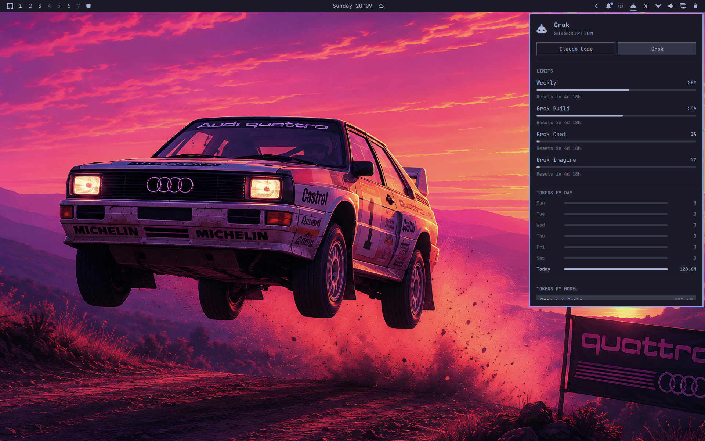

# Grok Usage

Adds **Grok** to Omarchy's **existing AI toolbar widget** — the AI icon already on the top bar. It does not add a second icon.

After install, click that same AI button. You get a **Grok** chip next to **Claude Code** (and Codex / Fireworks if you use them): weekly SuperGrok pool, Grok Build vs Chat vs Imagine, and local token stats from `~/.grok/sessions`.



## Install

```sh
omarchy plugin add https://github.com/dougfour/omarchy-grok-usage.git --enable
```

Requires:

- Omarchy with the stock AI widget enabled (`omarchy.agents`, on by default)
- Python 3 on `PATH` (stdlib only)
- Grok Build signed in (`grok login`) so weekly limits can load

Leave the built-in AI icon where it is. After the first scan, click it and switch to **Grok**.

## Usage

- Left click the existing AI icon: usage panel
- Switch to **Grok** with the chip in the panel (or middle-click the icon)
- `r` or Enter in the panel: refresh (Grok follows the stock update)
- Grok also refreshes about every 5 minutes

This plugin is a headless service. It only writes a Grok usage record for the stock panel to display.

Weekly percent comes from `https://cli-chat-proxy.grok.com/v1/billing?format=credits` using the token in `~/.grok/auth.json`. Token charts come from `~/.grok/sessions/**/updates.jsonl`.

## Remove

```sh
omarchy plugin remove io.github.dougfour.grok-usage
```

Removal deletes the plugin checkout and drops `~/.local/state/omarchy/agents/usage/grok.json`, so the Grok chip leaves the stock AI panel. It does not change `~/.grok/auth.json` or session files.

## Privacy

The collector reads local Grok session files and the saved Grok login, then calls xAI's billing endpoint. It never logs tokens. Expired tokens are not refreshed; run `grok login` (or start Grok) to renew them.

## License

MIT. See [LICENSE](LICENSE).
